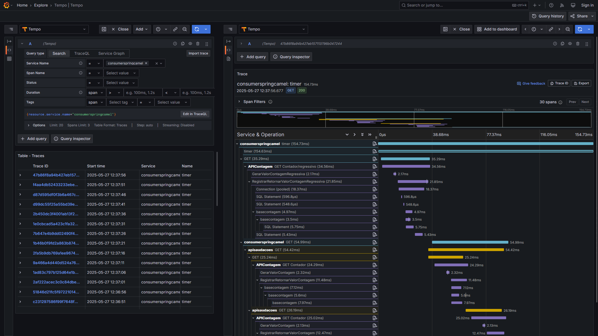

# aspnetcore9-otel-grafana-alloy-postgres-mysql_apicontagem
Exemplo de API REST criada com o .NET 9 + ASP.NET Core e utilizando Distributed Tracing com Grafana + OpenTelemetry + PostgreSQL + MySQL. Inclui o uso de Docker Compose para a subida de ambiente que faz uso da stack Grafana, incluindo o serviço Grafana Alloy (baseado em OTLP).

Aplicações que consomem este projeto:
- [**Saudações (Node.js)**](https://github.com/renatogroffe/nodejs-otel-jaeger_apisaudacoes)
- [**Consumer das APIs (Java + Spring + Apache Camel)**](https://github.com/renatogroffe/nodejs-otel-jaeger_apisaudacoes)

Visualizando no Grafana os traces gerados durante os testes:

